# Projeto AWS EC2 com NGINX


**Objetivo**:

Este projeto demonstra a configuração de uma instância EC2 na AWS executando um servidor NGINX simples, com o objetivo de observar o funcionamento de um load balancer. O projeto inclui a criação de uma instância Ubuntu, configuração de segurança, automação da instalação do NGINX através de user data, criação de uma imagem AMI, configuração de auto scaling.

## 📦 Documentação

**Criação da instancia:**

1. Criar a Instância Ubuntu
Acesse o console da AWS.
Navegue até o serviço EC2.
Clique em "Launch Instance".
Escolha a AMI Ubuntu mais recente.
Selecione o tipo de instância desejado (t2.micro para fins de teste).

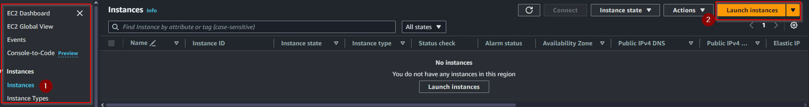

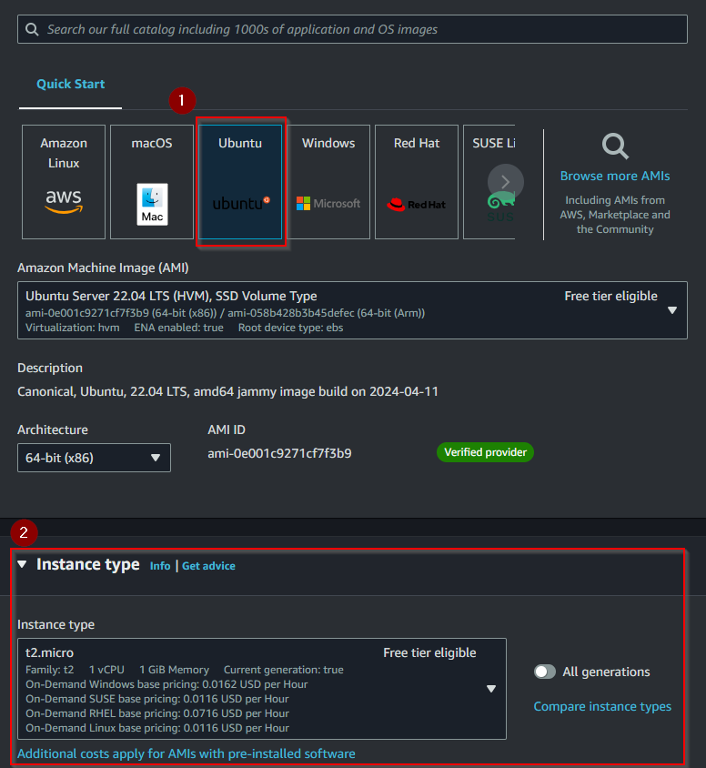

**Configuração da Instância**

Configure as permissões do IAM adequadamente.
Defina as regras de segurança para permitir tráfego HTTP e HTTPS.
Ative a criptografia para volumes de armazenamento se necessário.
Habilite a proteção contra encerramento para evitar encerramentos acidentais.

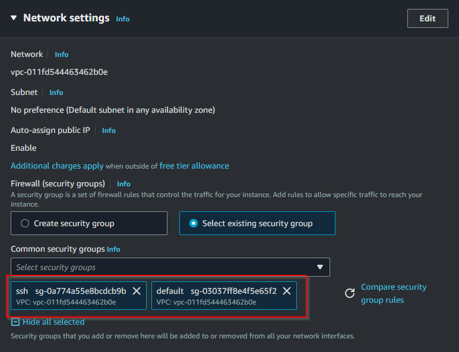

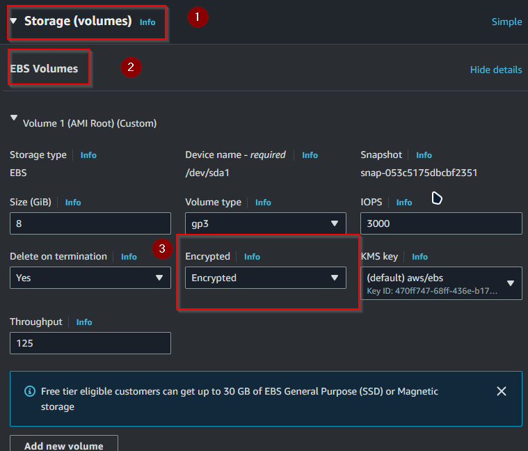

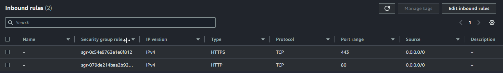

**User Data para Instalação e Configuração do NGINX**

No campo de User Data, insira o script abaixo para instalar e configurar o NGINX automaticamente:

```
#!/bin/bash
apt-get update
apt-get install -y nginx
systemctl start nginx
systemctl enable nginx
```
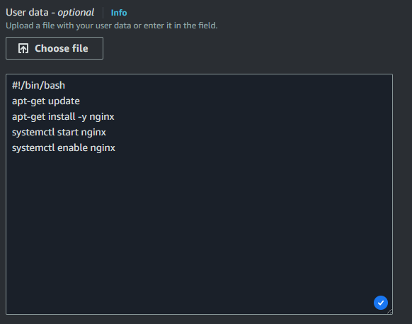


**Testando a instancia**

Para verificar se tudo ocorreu como planejado, vamos na console no serviço de EC2 e vamos verificar se nossa instacia está funcionando normalmente.

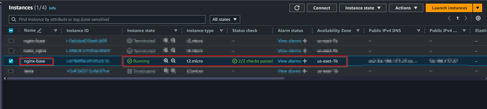

Também podemos testar se o Nginx foi iniciado corretamente, basta usar seu navegador e acessar o IP publico.

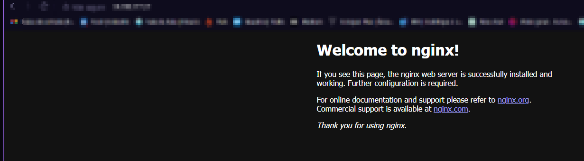


**Criação de AMI**

Após configurar e testar a instância, crie uma imagem AMI:
Acesse a instância no console EC2.
Clique em "Actions" > "Image and templates" > "Create image".
Preencha as informações necessárias e crie a imagem.

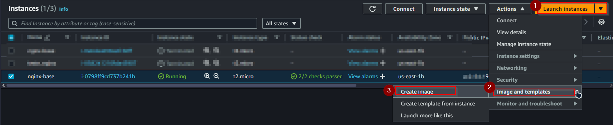

Apos, vamos até AMIs e vamos verificar se nossa imagem foi criada corretamente

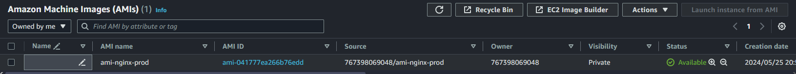


**Auto Scaling**

Fizemos a criação de um grupo para auto scaling, criando um template de maquinas utilizando como base a AMI que geramos

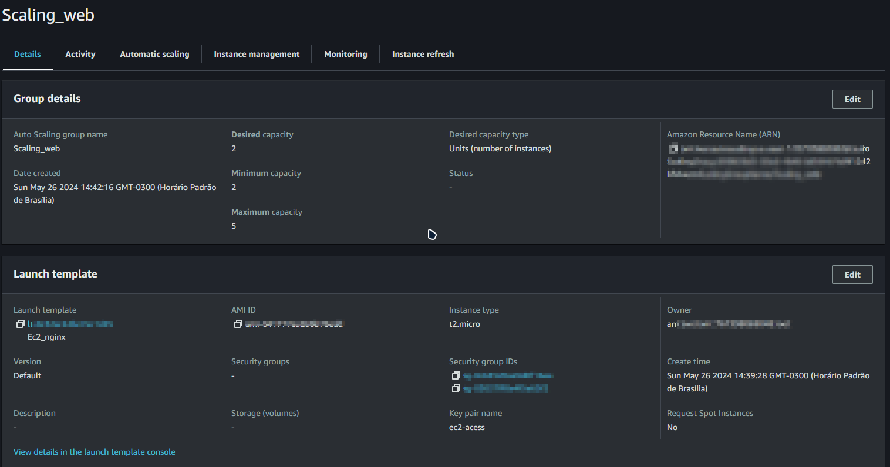

Definimos com a finalidade de teste, que seria criada nova instacia assim que fosse utilizado 20% de CPU

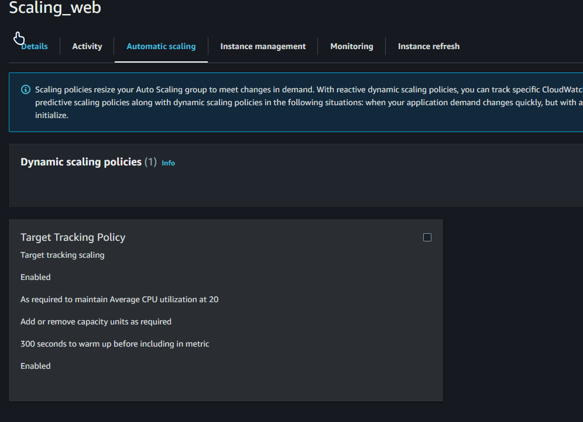

**Load balancers**

Vamos criar um balanceamento de carga entre as instancias, para isso inicialmente criamos um target group com as instancias e apos uum loadbalancer

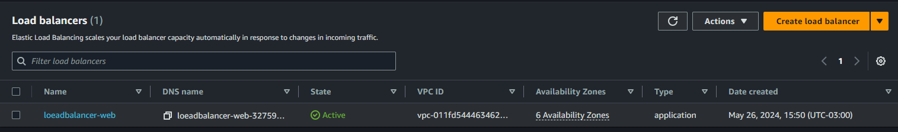

Para ver funcionando, vamos acessar o IP do loadbalancer e ficar recaregando a pagina. quando subimos as maquinas, colocamos um script para exibir o ip no /site.html

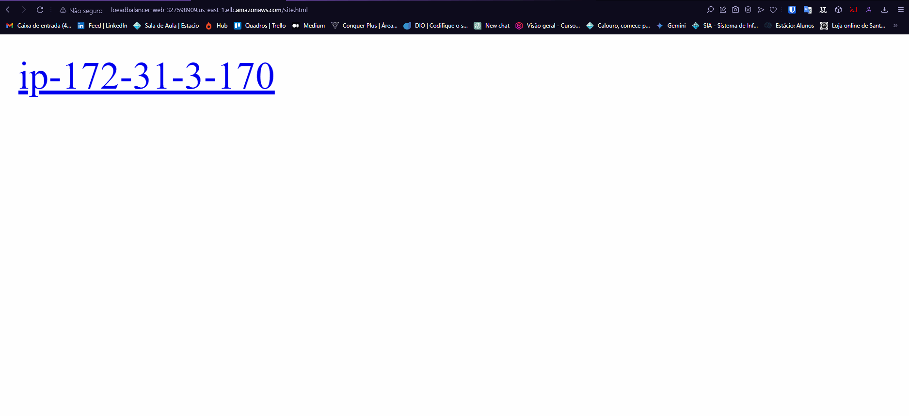

## Finalizamos

Este projeto cobre a configuração básica de uma instância EC2 na AWS executando um servidor NGINX, com práticas recomendadas de segurança e gerenciamento de escalabilidade. Utilizar auto scaling garante a alta disponibilidade e resiliência do serviço.

Abaixo vemos o auto scaling funcionando corretamente.

1. Geramos uma sobrecarga nas instancias

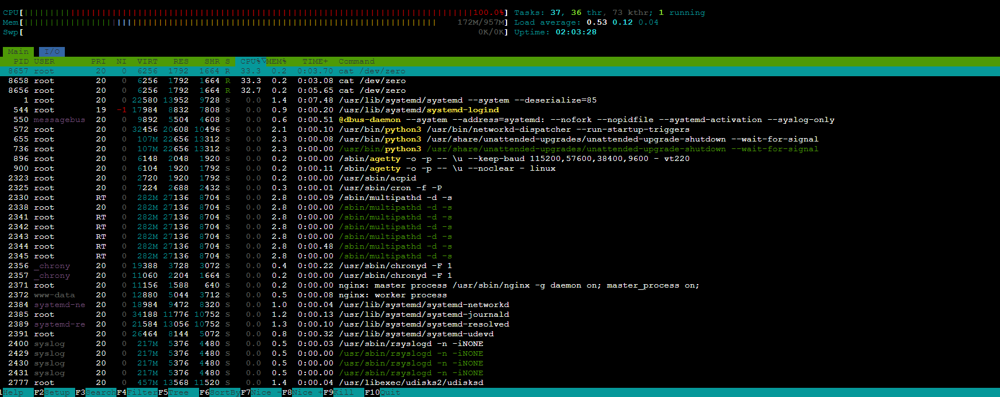

2. Podemos ver que o Auto Scaling visualiza essa sobrecarga e adicionar mais instancias

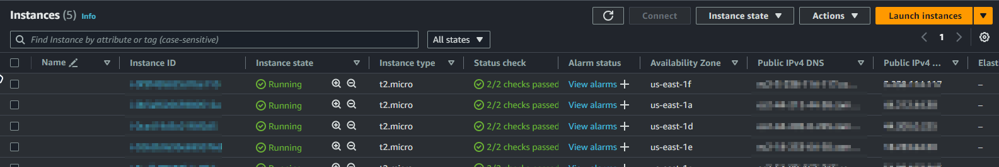


⌨️ com ❤️ por [Elias Assunção](https://github.com/Hooligam) 🔥
